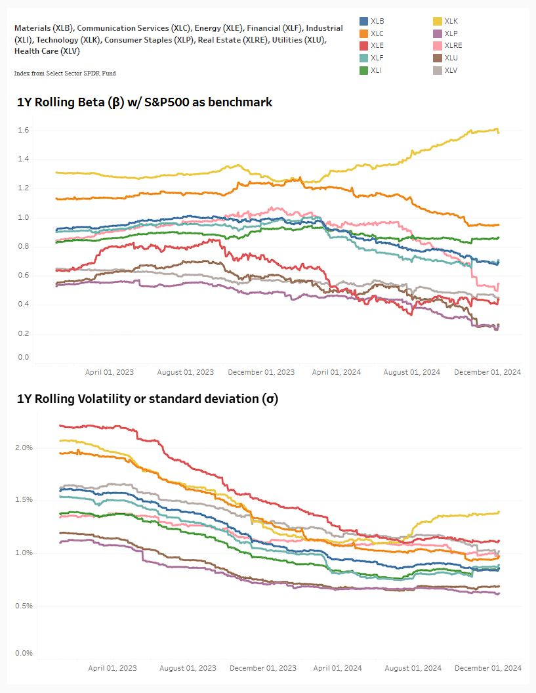

# Alpha-Beta-Explorer
###### Analyzing market betas to assess asset sensitivity, systematic risk, and portfolio implications  
 

### [Treasury Beta](https://github.com/s1dewalker/Alpha-Beta-Explorer/blob/main/py_files/Betas.ipynb)
##### In this we calculate Treasury Beta using multiple linear regression with 7-10 year treasury ETF and equity benchmark return 
 

### [The Rolling Sigmas (and Betas)](https://github.com/s1dewalker/Alpha-Beta-Explorer/blob/main/py_files/The_Rolling_Sigmas.ipynb)
##### In this we calculate the 1-year rolling beta w/ S&P500 as benchmark and 1-year rolling standard deviation for 10 major sectors of NYSE stocks
##### [Check Tableau visualization](https://public.tableau.com/app/profile/sujay.bahumik/viz/TheRollingSigmasandBetas/Dashboard1#2)

